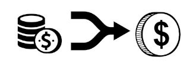

Check out my showcase on the ethglobal website: https://ethglobal.com/showcase/undefined-mqesv

# Project Description

This project aims to make it easier to unify all of your assets across multiple chains. For example you may have USDC on Base, Arbitrum... DAI on Optimism, Mainnet.. etc. That's just 2 tokens.

For a user to bring all of these tokens together into one asset 'pile' (such as all into ETH or a stablecoin) is a pain, requiring bridging, exchanges, and many transactions for the user. It would be great if you could click a 'big red button' to convert all of these tokens across many chains into one asset, on one chain. That is exactly what this project aims to do.

# How it's Made

This project uses Biconomy's Klaster SDK and Coinbase's Onchain Kit SDK. Tools used from Onchain Kit SDK include Swaps, ConnectWallet and other UI/UX components such as a drop-down token menu and the Identity components. create onchain was also used as a boilerplate for the project. Tools used from Klaster SDK include the MultichainReadOnly client, token mapping tools and RPC info.

Onchain kit provided a basically seamless implementation of wallet connecting and UX/UI components, the boilerplate is also very pretty. Klaster SDK was very helpful in collating the balances of tokens across many chains. Unfortunately I did not get to the stage of signing and sending swap/bridge transactions (as of the current submission).

Initially I was going to use Klaster SDK interchain transactions in order to do bridging & swaps, however I discovered this could only be done with a Klaster SDK smart wallet, whereas I wanted to do this with EOAs - I believe EIP-3047 would be very beneficial to this project in the future.

The whole project is crammed into one giant page.tsx file. Yes. I split the project into several functions plus the page component. There is getMultichainBalances, onchainKitSwap, swapMultichainTokens, bridgeMultichainTokens and App.

The whole thing works by first connecting with the WagmiProvider which has been written into the onchainkit boilerplate. You can then connect with either mobile wallet or smart wallet. When the user clicks the button, the getMultichainBalances is triggered, and the balances of hardcoded tokens DAI and USDC are retrieved from Arbitrum, Base and Optimism (for proof of concept). Depending on the selected 'target coin' and 'target chain' swaps will be executed via swapMultichainTokens/onchainKitSwap. This is essentially as far as I got.
